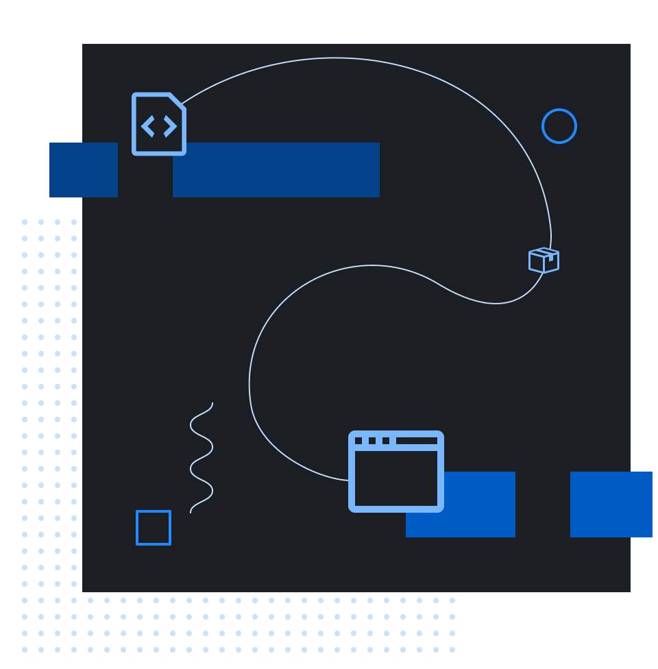

<p align="center">
  
</p>

<h1 align="center">Primer CSS</h1>

<p align="center">The CSS implementation of GitHub's Primer Design System</p>

<p align="center">
  <a aria-label="npm package" href="https://www.npmjs.com/package/@primer/css">
    
  </a>
  <a aria-label="build status" href="https://github.com/primer/css/actions/workflows/ci.yml">
    
  </a>
  <a aria-label="contributors graph" href="https://github.com/primer/css/graphs/contributors">
    
  </a>
  <a aria-label="last commit" href="https://github.com/primer/css/commits/main">
    
  </a>
  <a aria-label="license" href="https://github.com/primer/css/blob/main/LICENSE">
    
  </a>
</p>

## Documentation

> :warning: It is encouraged that you use [primer/react](https://github.com/primer/react) and [primer/view_components](https://github.com/primer/view_components) for styling and markup.

> :warning: **The documentation of this repo is not maintained anymore**. Please raise any documentation-specific pull requests in [primer.style/design](https://github.com/primer/design/)

Our documentation site lives at [primer.style/css](https://primer.style/css). You'll be able to find detailed documentation on getting started, all of the components, our theme, our principles, and more.

## Install
This repository is distributed with [npm]. After [installing npm][install-npm], you can install `@primer/css` with this command:

```sh
npm install --save @primer/css
```

## Usage
The included source files are written in [Sass] using SCSS syntax. After [installing](#install) with npm, you can add your project's `node_modules` directory to your Sass [include paths](https://github.com/sass/node-sass#includepaths) (AKA [load paths](http://technology.customink.com/blog/2014/10/09/understanding-and-using-sass-load-paths/) in Ruby), then import it like this:

```scss
@import "@primer/css/index.scss";
```

You can import individual Primer modules directly from the `@primer/css` package:

```scss
@import "@primer/css/core/index.scss";
@import "@primer/css/product/index.scss";
@import "@primer/css/marketing/index.scss";
```

## Development
See [DEVELOP.md](DEVELOP.md) for development docs.

## Releasing (for GitHub staff)
You can find docs about our release process in [RELEASING.md](RELEASING.md).

## License

[MIT](./LICENSE) &copy; [GitHub](https://github.com/)


[install-npm]: https://docs.npmjs.com/getting-started/installing-node
[npm]: https://www.npmjs.com/
[primer]: https://primer.style/
[sass]: http://sass-lang.com/### AfricaCryptoChainx Project Plan

#### 1. **Research and Learning**
- **Resources**: Utilize free online courses and materials on platforms like [Coursera](https://www.coursera.org/), [edX](https://www.edx.org/), and [YouTube](https://www.youtube.com/) to learn about blockchain technology, cryptocurrency, and project management.
- **Cost**: Free

#### 2. **Networking**
- **Platforms**: Join online communities such as Reddit (e.g., [r/cryptocurrency](https://www.reddit.com/r/cryptocurrency/)), [GitHub](https://github.com/), and [LinkedIn](https://www.linkedin.com/) groups focused on blockchain and cryptocurrency.
- **Cost**: Free

#### 3. **Open Source Tools**
- **Blockchain Platform**: Use [Ethereum](https://ethereum.org/en/) or [Hyperledger](https://www.hyperledger.org/), which are open-source and free to use.
- **Development Tools**: Leverage [Visual Studio Code (VS Code)](https://code.visualstudio.com/) for coding and [GitHub](https://github.com/) for version control and collaboration.
- **Cost**: Free

#### 4. **Minimal Viable Product (MVP)**
- **Objective**: Develop a basic version of your cryptocurrency to demonstrate the concept.
- **Code Examples**: Use free code repositories and samples available on [GitHub](https://github.com/).
- **Tools**: [Solidity](https://soliditylang.org/) for smart contracts, [Truffle Suite](https://www.trufflesuite.com/) for testing and development.
- **Cost**: Free

#### 5. **Freelancers**
- **Platforms**: Hire freelancers from [Upwork](https://www.upwork.com/) or [Fiverr](https://www.fiverr.com/) for specific tasks you cannot handle yourself (e.g., graphic design, additional coding).
- **Budget**: Allocate $100 for freelance assistance.
- **Cost**: $100

#### 6. **Community Support**
- **Engagement**: Participate in forums like [Stack Exchange](https://stackexchange.com/) and [Discord](https://discord.com/) channels to seek advice and find collaborators.
- **Cost**: Free

#### 7. **Domain and Hosting**
- **Domain**: Purchase a domain name for your project (e.g., from [GoDaddy](https://www.godaddy.com/) or [Namecheap](https://www.namecheap.com/)).
- **Budget**: Allocate $20 for the domain name.
- **Cost**: $20

### Example Budget Allocation

| Expense                          | Estimated Cost |
|----------------------------------|----------------|
| Freelance Assistance             | $100           |
| Domain Name                      | $20            |
| Online Courses/Resources         | Free           |
| Development Tools and Software   | Free           |
| Community Engagement             | Free           |
| **Total**                        | **$120**       |

### Cryptocurrency Integration
**Cryptocurrency Integration**: Integrate support for a variety of coins, including:
- Bitcoin (BTC)
- Ethereum (ETH)
- Binance Coin (BNB)
- Stablecoins (USDT, USDC, DAI)
- Cardano (ADA)
- Solana (SOL)
- Polkadot (DOT)
- Chainlink (LINK)
- Litecoin (LTC)
- African-based coins (e.g., Akoin)
- BakeryToken (BAKE)
- My Neighbour Alice (ALICE)

AfricaCryptoChainx aims to introduce its own native coins alongside established cryptocurrencies to support financial inclusion and DeFi functionalities in Africa. Potential coin names include:

- AfricaCryptoChainx Coin (ACC)
- Africoin (AFR)
- AfroToken (AFT)
- Sahara Coin (SHC)
- Savanna Token (SAV)
- Zambezi Coin (ZBC)
- Kilimanjaro Token (KMT)
- Ubuntu Coin (UBC)
- Serengeti Token (SGT)
- CapeCoin (CPC)
- Victoria Coin (VIC)
- Nile Token (NLT)
- Kalahari Coin (KHC)
- Rift Token (RFT)
- Baobab Coin (BBC)
- Acacia Token (ACT)
- Congo Coin (CGC)
- Atlas Token (ATS)
- Oasis Coin (OSC)
- Horizon Token (HRT)
- Eden Coin (EDC)
- Gateway Token (GAT)
- Unity Coin (UTC)
- Harmony Token (HMT)
- Heritage Coin (HTC)
- Liberty Token (LBT)
- Pride Coin (PDC)
- Essence Token (EST)
- Destiny Coin (DSC)
- Pulse Token (PLT)
- Eclipse Coin (ECC)
- Legacy Token (LGC)
- Fortune Coin (FRC)
- Prosperity Token (PRT)
- Wisdom Coin (WSC)
- Vision Token (VST)
- Genesis Token (GST)
- Spirit Coin (SPC)
- Sovereign Token (SOV)
- Summit Coin (SMT)
- Citadel Token (CTT)
- Foundation Coin (FDT)

These native coins will facilitate secure and accessible financial services tailored for African communities, promoting economic empowerment and sustainable development.

### Trading and Exchange
The native coins developed by AfricaCryptoChainx, including ACC, AFR, AFT, and others, will be listed on cryptocurrency exchanges. This allows users to buy, sell, and trade these coins alongside established cryptocurrencies such as Bitcoin (BTC), Ethereum (ETH), Binance Coin (BNB), Stablecoins (USDT, USDC, DAI), Cardano (ADA), Solana (SOL), Polkadot (DOT), Chainlink (LINK), Litecoin (LTC), and African-based coins like Akoin, BakeryToken (BAKE), and My Neighbour Alice (ALICE). Users can participate in the market value of these coins through various trading pairs offered by exchanges.

### Free Bot and Code
You can create a simple bot using free services like GitHub Actions for continuous integration and deployment, and Telegram or Discord for community engagement.

Here's an example code snippet for creating a basic Telegram bot using Python:

```python
import telegram
from telegram.ext import Updater, CommandHandler

# Your bot token from BotFather
bot_token = 'YOUR_BOT_TOKEN'

def start(update, context):
    context.bot.send_message(chat_id=update.effective_chat.id, text="Hello! Welcome to AfricaCryptoChainx!")

updater = Updater(token=bot_token, use_context=True)
dispatcher = updater.dispatcher

start_handler = CommandHandler('start', start)
dispatcher.add_handler(start_handler)

updater.start_polling()
updater.idle()
```

This example sets up a basic Telegram bot that responds with a welcome message when the `/start` command is used.

### ACCXBOT
You can also include your bot in your communications or documentation to provide support and engagement for your project:
- **ACCXBOT**: [Link to ACCXBOT](#)

### Funding
AfricaCryptoChainx.Com is seeking one-time funding between $50,000 to $100,000 to:
- Deploy secure infrastructure.
- Integrate with local P2P networks.
- Implement advanced security measures.
- Develop an intuitive user interface.
- Create educational resources.
- Launch community engagement initiatives.
- Integrate DeFi functionalities for African markets.

### Additional Enhancements
1. **User Education and Awareness**:
   - **Educational Resources**: Create informative blog posts, videos, and tutorials to help users understand cryptocurrency, staking, and how to use our platform.
   - **Webinars and Workshops**: Host online events to educate users about blockchain technology and the benefits of using AfricaCryptoChainx.

2. **Community Building**:
   - **Engage on Social Media**: Build a presence on platforms like Twitter, Facebook, and LinkedIn to engage with our audience and share updates.
   - **Online Forums**: Create a forum on our website where users can discuss topics, share insights, and ask questions.

3. **Security Measures**:
   - **Multi-Factor Authentication (MFA)**: Implement MFA to enhance the security of user accounts.
   - **Regular Audits**: Conduct regular security audits to identify and address potential vulnerabilities.

4. **User Experience (UX) Optimization**:
   - **User Feedback Loop**: Establish a system for collecting and analyzing user feedback to continuously improve our platform.
   - **Intuitive Design**: Ensure our platform's design is user-friendly, making it easy for both beginners and experienced users to navigate.

5. **Partnerships and Collaborations**:
   - **Strategic Partnerships**: Partner with other blockchain projects, financial institutions, or educational organizations to expand our reach and resources.
   - **Collaborative Events**: Co-host events or webinars with partners to attract a wider audience.

6. **Innovative Features**:
   - **DeFi Integration**: Integrate Decentralized Finance (DeFi) features such as yield farming to attract more users.
   - **Mobile App**: Develop a mobile app to provide users with easy access to our platform on the go, ensuring seamless transactions within the app.
   - **NFT Marketplace**: Create a marketplace for Non-Fungible Tokens (NFTs) where users can buy, sell, and trade digital assets.
   - **Token Launchpad**: Develop a platform for launching new tokens and Initial Coin Offerings (ICOs).
   - **Premium Membership Plans**: Offer subscription-based premium memberships with exclusive benefits.
   - **Ad Space**: Sell advertising space on our platform to relevant businesses and projects.
   - **Affiliate Programs**: Partner with other platforms to offer affiliate programs and earn commissions
6. **Innovative Features**:
   - **DeFi Integration**: Integrate Decentralized Finance (DeFi) features such as yield farming to attract more users.
   - **Mobile App**: Develop a mobile app to provide users with easy access to our platform on the go, ensuring seamless transactions within the app.
   - **NFT Marketplace**: Create a marketplace for Non-Fungible Tokens (NFTs) where users can buy, sell, and trade digital assets.
   - **Token Launchpad**: Develop a platform for launching new tokens and Initial Coin Offerings (ICOs).
   - **Premium Membership Plans**: Offer subscription-based premium memberships with exclusive benefits.
   - **Ad Space**: Sell advertising space on our platform to relevant businesses and projects.
   - **Affiliate Programs**: Partner with other platforms to offer affiliate programs and earn commissions.
   - **In-App Purchases**: Introduce in-app purchases for virtual goods, services, or additional features.
   - **Educational Courses**: Offer paid educational courses and certifications on cryptocurrency and blockchain technology.
   - **Consulting Services**: Provide consulting services for businesses looking to integrate blockchain technology.
   - **Merchandise Store**: Sell branded merchandise through an online store.
   - **Crypto Games**: Develop engaging crypto games where users can deposit and win coins. Ensure these games are transparent, fair, and provide a way for the platform to earn a share of the profits.
   - **Walk and Earn**: Introduce a feature where users can earn coins for physical activities such as walking or running, promoting healthy habits while engaging users.

7. **Regulatory Compliance**:
   - **Stay Informed**: Keep up-to-date with regulations in the cryptocurrency space to ensure our platform remains compliant.
   - **Transparent Policies**: Clearly communicate our platform's policies and compliance measures to build trust with our users.

### Completion Criteria
- All key features implemented and tested.
- User and developer documentation available.
- Positive feedback from beta testers.
- Marketing materials ready.
- Full access control

**Full Access Control**: As the initiator, developer, and co-founder of AfricaCryptoChainx, I maintain full access control over the project to ensure its vision and integrity are upheld.[Alien Innovation Ruleset.json](https://github.com/user-attachments/files/18706036/Alien.Innovation.Ruleset.json)
[_downloads_GitHub_Actions-Cheat-Sheet-One-Pager.pdf](https://github.com/user-attachments/files/18706034/_downloads_GitHub_Actions-Cheat-Sheet-One-Pager.pdf)
[export-0xb27adaffb9fea1801459a1a81b17218288c097cc.csv](https://github.com/user-attachments/files/18706032/export-0xb27adaffb9fea1801459a1a81b17218288c097cc.csv)
[Blockchain-Technology-05f4c8f613ca7bdbc91257c13e03e6f285ef4f60.zip](https://github.com/user-attachments/files/18706031/Blockchain-Technology-05f4c8f613ca7bdbc91257c13e03e6f285ef4f60.zip)
[gitignore.txt](https://github.com/user-attachments/files/18706029/gitignore.txt)
[README.md](https://github.com/user-attachments/files/18706028/README.md)
[fortify.yml.txt](https://github.com/user-attachments/files/18706026/fortify.yml.txt)
[CPOL.zip](https://github.com/user-attachments/files/18706025/CPOL.zip)
[AfricaCryptoChainx-Core-Innovators--main.zip](https://github.com/user-attachments/files/18706024/AfricaCryptoChainx-Core-Innovators--main.zip)
[AfricaCryptoCryptoChainx.Com.CI.and.Project.Guidelines.json](https://github.com/user-attachments/files/18706023/AfricaCryptoCryptoChainx.Com.CI.and.Project.Guidelines.json)
[CODE_OF_CONDUCT.md](https://github.com/user-attachments/files/18706022/CODE_OF_CONDUCT.md)
[africacryptochainx-teachmastermindpat-transactions.csv](https://github.com/user-attachments/files/18706021/africacryptochainx-teachmastermindpat-transactions.csv)
[africacryptochainxinnovatorscom-202408-transactions.csv](https://github.com/user-attachments/files/18706020/africacryptochainxinnovatorscom-202408-transactions.csv)
[20250109-africacryptochainx-core-innova-members-all.csv](https://github.com/user-attachments/files/18706018/20250109-africacryptochainx-core-innova-members-all.csv)
[AfricaCryptoChainx - AfricaCryptoChainx View 1.tsv.csv](https://github.com/user-attachments/files/18706016/AfricaCryptoChainx.-.AfricaCryptoChainx.View.1.tsv.csv)
[AfricaCryptoChainx-Core-Innovator_demo-repository_24591c.json](https://github.com/user-attachments/files/18706015/AfricaCryptoChainx-Core-Innovator_demo-repository_24591c.json)
[data.yaml.txt](https://github.com/user-attachments/files/18706014/data.yaml.txt)
[github-recovery-codes.txt](https://github.com/user-attachments/files/18706013/github-recovery-codes.txt)
[AfricaCryptoChainx-Core-Innovator_demo-repository_b2a78a.json](https://github.com/user-attachments/files/18706012/AfricaCryptoChainx-Core-Innovator_demo-repository_b2a78a.json)
[AfricaCryptoChainx-Core-Innovator_demo-repository_44b2cb.json](https://github.com/user-attachments/files/18706010/AfricaCryptoChainx-Core-Innovator_demo-repository_44b2cb.json)
[AfricaCryptoChainx-Core-Innovator_AfricaCryptoChainx-Ccxt-Wallet-_9f2876.json](https://github.com/user-attachments/files/18706009/AfricaCryptoChainx-Core-Innovator_AfricaCryptoChainx-Ccxt-Wallet-_9f2876.json)
[AfricaCryptoChainx-Core-Innovator_demo-repository_e37d46.json](https://github.com/user-attachments/files/18706008/AfricaCryptoChainx-Core-Innovator_demo-repository_e37d46.json)
[logs_33226045655.zip](https://github.com/user-attachments/files/18706007/logs_33226045655.zip)
[AfricaCryptoChainx-Wallet_demo-repository_4894c2.json](https://github.com/user-attachments/files/18706006/AfricaCryptoChainx-Wallet_demo-repository_4894c2.json)
[GitHub.ISO.27001.Certificate.Award.5.9.2024.pdf](https://github.com/user-attachments/files/18706005/GitHub.ISO.27001.Certificate.Award.5.9.2024.pdf)
[GitHub.Enterprise.Cloud.SOC.3.ISAE.Report.11-26-24.pdf](https://github.com/user-attachments/files/18706004/GitHub.Enterprise.Cloud.SOC.3.ISAE.Report.11-26-24.pdf)
[export-AfricaCryptoChainx-Core-Innovator-1737390002.json](https://github.com/user-attachments/files/18706002/export-AfricaCryptoChainx-Core-Innovator-1737390002.json)
[0bfadc07_2025-01-24_7.csv](https://github.com/user-attachments/files/18706001/0bfadc07_2025-01-24_7.csv)
[release_tracking.yml.txt](https://github.com/user-attachments/files/18706000/release_tracking.yml.txt)
[AfricaCryptoChainx.-.AfricaCryptoChainx.View.1.tsv.csv](https://github.com/user-attachments/files/18705999/AfricaCryptoChainx.-.AfricaCryptoChainx.View.1.tsv.csv)
[b8cae4e987b4b99893dfc134ce6983fe-cefafadea476f9ede1871d7bb0e1af55d89cbbf1.zip](https://github.com/user-attachments/files/18705998/b8cae4e987b4b99893dfc134ce6983fe-cefafadea476f9ede1871d7bb0e1af55d89cbbf1.zip)
[test-lab-docker-kubernetes-admin-magazine-article.pdf](https://github.com/user-attachments/files/18705997/test-lab-docker-kubernetes-admin-magazine-article.pdf)
[PatforJesus_AfricaCryptoChainx-Ccxt-Wallet-_9d8159.json](https://github.com/user-attachments/files/18705996/PatforJesus_AfricaCryptoChainx-Ccxt-Wallet-_9d8159.json)
[bulk-sponsorships-template.csv](https://github.com/user-attachments/files/18705995/bulk-sponsorships-template.csv)### Revised Workflow Configuration

```yaml
name: Release Event Tracking
# Measure a Datadog event every time a release occurs

on:
  pull_request:
    types:
      - closed
      - opened
      - reopened

  release:
    types: [published]

jobs:
  release-tracking:
    name: Release Tracking
    runs-on: ubuntu-latest

    steps:
      - name: Checkout code
        uses: actions/checkout@v2

      - name: Run Release Tracking Workflow
        uses: primer/.github/.github/workflows/release_tracking.yml@v2.1.1
        with:
          datadog_api_key: ${{ secrets.DATADOG_API_KEY }}
```

